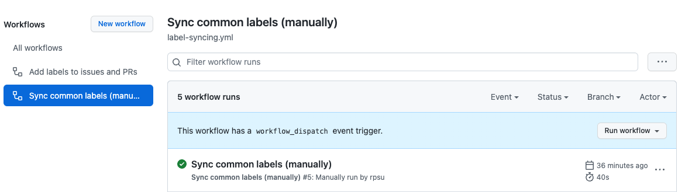

# gh-project-actions

Github actions for helping automated management of repository or CI/CD builds.

## Using `label-sync` action

Create a Github workflow file such as this in your repository.

```yaml
name: Sync common labels (manually)

on: workflow_dispatch

jobs:
  labels_sync:
    runs-on: ubuntu-latest
    steps:
      - name: Checkout
        uses: actions/checkout@v3

      - name: Run Labeler
        uses: Yleisradio/articleteam-gh-actions/label-sync@main
        env:
          GITHUB_TOKEN: ${{ secrets.GITHUB_TOKEN }}
```

`workflow_dispatch` event is triggered only manually via repsitory's Actions:



## Using `yarn-install` action

Create a Github workflow file and use this caching Yarn installer:

```yaml
name: CI

on: push

jobs:
  test:
    runs-on: ubuntu-latest
    steps:
      - uses: actions/checkout@v3

      - name: Yarn install
        uses: Yleisradio/articleteam-gh-actions/yarn-install@v1
        with:
          npm-auth-token: ${{ secrets.NPM_TOKEN }}
```
